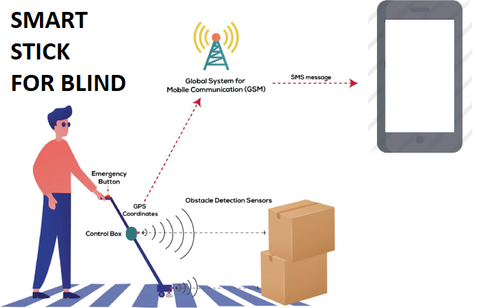
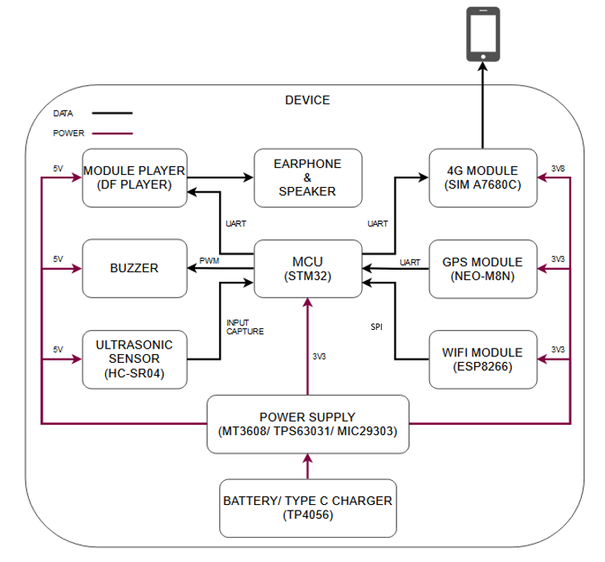

<!-- PROJECT LOGO -->
<br />
<div align="center">
  <a href="https://github.com/bitbydat/Test-Git">
    
  </a>

<h3 align="center">Navigation and Obstacle Detection Device for the Visually Impaired</h3>

  <p align="center">
    My graduation project in Control and Automation Engineering (semester 2025.1)
    <br />
    <a href="https://docs.google.com/document/d/1b8eUY19hVWinYOA9YIkjcR_toliwRPs9/edit?usp=sharing&ouid=113352961761938394358&rtpof=true&sd=true"><strong>Explore the docs »</strong></a>
    <br />
    <br />
    <a href="https://github.com/hungdaqq/Smarthome-IoT">View Demo</a>
    ·
    <a href="https://github.com/hungdaqq/Smarthome-IoT/issues">Report Bug</a>
    ·
    <a href="https://github.com/hungdaqq/Smarthome-IoT/issues">Request Feature</a>
  </p>
</div>


<!-- TABLE OF CONTENTS -->
<details>
  <summary>Table of Contents</summary>
  <ol>
    <li>
      <a href="#about-the-project">About The Project</a>
      </ul>
    </li>
    <li>
      <a href="#getting-started">Getting Started</a>
      <ul>
        <li><a href="#prerequisites">Prerequisites</a></li>
        <li><a href="#installation">Installation</a></li>
      </ul>
    </li>
    <li><a href="#usage">Usage</a></li>
    <li><a href="#roadmap">Roadmap</a></li>
    <li><a href="#contributing">Contributing</a></li>
    <li><a href="#license">License</a></li>
    <li><a href="#contact">Contact</a></li>
    <li><a href="#acknowledgments">Acknowledgments</a></li>
  </ol>
</details>


<!-- ABOUT THE PROJECT -->
## About The Project

<p align="justify">
This device is designed to detect distant obstacles and provide a warning mechanism for the visually impaired, helping them move safely and confidently. In case the user gets lost, the device is equipped with accurate positioning capabilities and can send a message containing the user's location to their family members. Below are the basic requirements of the project: </p>

- Measure the ***distance*** to obstacles and determine their ***direction***.
- Warning mechanism using ***pre-recorded audio alerts***.
- ***Indoor and outdoor positioning*** capability; send ***messages*** to family members' phones.
- Equipped with a ***battery*** and ***charging circuit***.
- Notify working status, charging status, and battery level.

Project structure:
- `ESP8266` is a brief explanation of how to use Platform.io to create a microcontroller programming environment.
- `Thingsboard` contains template files for the Thingsboard Server configuration.
- `Features` is where we demonstrate the features and capabilities of this Smart Home, as well as how to implement them using the provided code, hardware schema, and controller interface.
<!-- GETTING STARTED -->
## Getting Started
<br />
<div align="center">
  <a href="https://github.com/bitbydat/Test-Git">
    
  </a>
<p align="justify">
The project's deployment diagram is shown here.<br>
Three ultrasonic sensors will detect and measure the distance to obstacles in three directions. Based on the distance data, the microcontroller will either trigger the playback of an audio file via the DFPlayer module or activate a buzzer for warning. The positioning system combines GPS and LBS to overcome the limitation of GPS not working well indoors. LBS is implemented using 4G-based location services via the A7680C module and Wi-Fi-based positioning through the ESP32. The power supply and charging circuits are designed to provide precise operating voltages to peripherals and support long-term standalone operation of the device.</p>

### Prerequisites
Before getting started with the project, you will need the following:
| Hardware | Software |
|----------|----------|
|x01 STM32F103C8 or a similar microcontroller.|Proficient in C/C++ programming for embedded systems, familiar with ARM Cortex-M3, experienced with FreeRTOS (tasks, semaphores, timers)|
|x03 ultrasonic sensors (e.g., HC-SR04, SRF05) and x01  audio playback module (e.g., DFPlayer Mini with microSD card)  |Understanding of PWM and input capture for interfacing with ultrasonic sensors, and familiar with USART communication.|
|x01 GPS modules (e.g., NEO-M8N, Quectel L80); x01 4G modules with LBS support like A7680C and A7682S. |Skilled in USART communication, optionally uses DMA to improve performance and reduce CPU load, and experienced with AT commands|
|x01 module capable of Wi-Fi scanning and HTTP/HTML communication (e.g., ESP32, ESP8266 |Proficient in I2C/SPI communication; experienced with ESP32SPISlave.h, WiFi.h and able to make Geolocation API calls over HTTP/HTML|


### Installation
<div align="left">
  
1. Clone the repo:
   ```sh
   git clone https://github.com/hungdaqq/Smarthome-IoT.git
   ```
2. Create a Thingsboard account at https://demo.thingsboard.io/ and login to use Thingsboard Live Demo server. Then go to [Thingsboard](https://github.com/hungdaqq/Smarthome-IoT/tree/main/Thingsboard) for a quick overview of this open-source IoT platform.
3. Follow the instructions to install [Thingsboard Edge CE](https://thingsboard.io/docs/user-guide/install/edge/installation-options/) v3.4.3 and provision your Edge to the Server.
5. Get and install the ThingsBoardLive on [App Store](https://apps.apple.com/us/app/thingsboard-live/id1594355695) or [Google Play](https://play.google.com/store/apps/details?id=org.thingsboard.demo.app&hl=vi&gl=US).
7. Please refer to [ESP8266](https://github.com/hungdaqq/Smarthome-IoT/tree/main/ESP8266) for setting up micro controllers programming evironment and [Features](https://github.com/hungdaqq/Smarthome-IoT/tree/main/Features) for ThingsBoard configuration as well as connecting the electronics components in accordance with the hardware schema.
9. (Optional) Follow the instructions to install [Thingsboard IoT Gateway](https://thingsboard.io/docs/iot-gateway/installation/) v2.9 on your Raspberry Pi or PC if you want integrate devices that are connected to legacy and third-party systems with ThingsBoard IoT platform. For example: external MQTT brokers, OPC-UA servers, Sigfox Backend, Modbus slaves or CAN nodes.


</div>

<!-- ROADMAP -->
## Achievements and Future Work

<div align="left">

- ✔️ Detect obstacles from a distance and provided timely audio warnings.
- ✔️ Achieved reliable positioning using a combination of GPS and LBS.
- ✔️ Send SMS alerts to notify family members when the user is lost.
- ⬜ Integrate a web/app interface to allow users to easily configure the device and monitor its information. 
- ⬜ Integrate with a camera to enable object recognition and classification.
- ⬜ Design and develop a complete enclosure, integrating all components into a compact and finalized smart cane. 

</div>

<!-- CONTRIBUTING -->
## Contributing

I welcome contributions to this project. If you have suggestions, improvements, or new ideas, feel free to open an issue or submit a pull request. Your input is greatly appreciated and helps me improve.

<!-- CONTACT -->
## Contact

Dat Duy Nguyen - datndng01@gmail.com

Project Link: [https://github.com/hungdaqq/Smarthome-IoT/](https://github.com/hungdaqq/Smarthome-IoT/)

</p>
